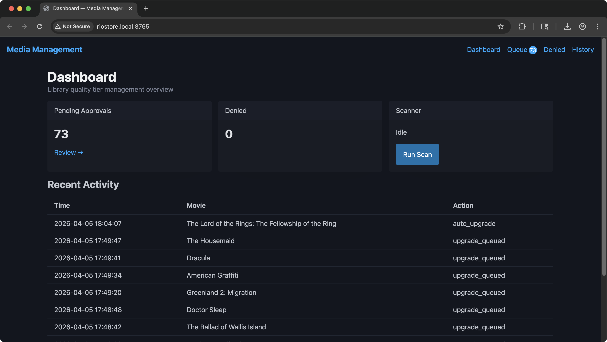
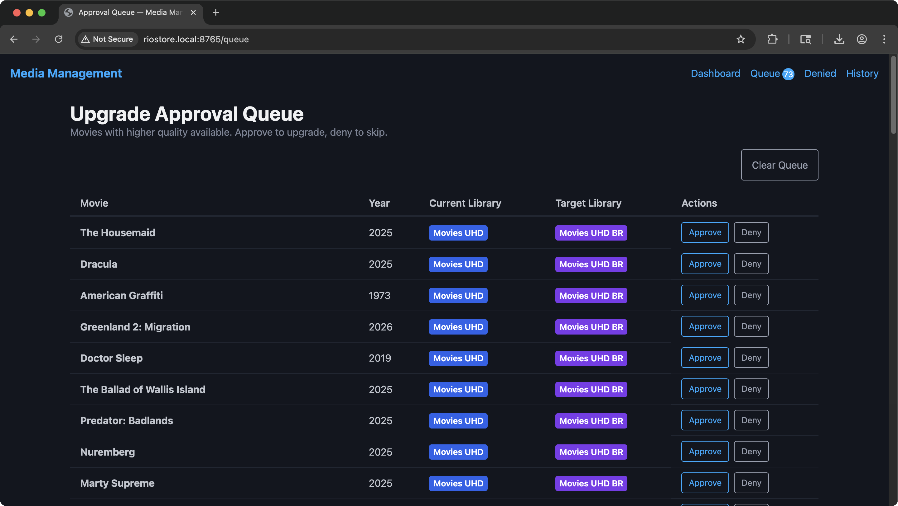

# Media Management

> **Who is this for?** If you use Radarr and Plex and split different quality media into separate libraries (e.g., a 4K remux library and an HD library), this service keeps movies in the right one. If you keep all qualities in a single library, Radarr handles upgrades natively and you don't need this.

A service that monitors Radarr and automatically manages movies across multiple Plex libraries based on quality tiers. Define your libraries and quality tiers in config — the service ensures every movie lives in the right one.

For example, a setup with three tiers:

- **Movies UHD BR** (Tier 1) — 4K Blu-Ray remuxes (highest quality)
- **Movies UHD** (Tier 2) — 4K web-rips, WEB-DL, encodes
- **HD** (Tier 3) — 1080p content

## Screenshots





## What it does

Movies sometimes end up in the wrong library — either because the target quality doesn't exist yet (e.g., added to UHD BR but no remux is available) or because a better quality becomes available over time (e.g., a 4K remux releases months after the web-rip).

This service:

- **Scans** all movies on a schedule, checking indexers for available qualities
- **Auto-downgrades** movies when the target quality doesn't exist (UHD BR → UHD → HD)
- **Auto-upgrades** movies when a better quality is available and nothing has downloaded yet
- **Queues upgrades for approval** when a movie already has a file — review and approve/deny via the web UI
- **Tracks denied upgrades** so they aren't re-suggested on every scan
- **Sends Pushover notifications** when new upgrade candidates are found
- **Receives Radarr webhooks** to evaluate newly added movies immediately

## Tech Stack

- TypeScript / Node.js 20
- Fastify (web server)
- better-sqlite3 (database)
- Nunjucks + HTMX + Pico CSS (server-rendered UI)
- Docker (deployment)

## Setup

### 1. Clone and configure

```bash
git clone https://github.com/jphelan82/MediaManagement.git
cd MediaManagement
cp config/default.yaml.example config/default.yaml
```

Edit `config/default.yaml` with your Radarr API key, root folder paths, quality profile IDs, and optionally Pushover credentials.

### 2. Deploy with Docker

```bash
docker compose up -d --build
```

The web UI will be available at `http://<host>:8765`.

### 3. Configure Radarr webhook

In Radarr: **Settings → Connect → + → Webhook**

- **URL**: `http://<this-service-host>:8765/webhooks/radarr`
- **Events**: On Movie Added
- Hit **Test**, then **Save**

## Docker Operations

All commands run from the project directory on the host machine.

### View logs

```bash
docker compose logs -f
```

Show only the last 50 lines:

```bash
docker compose logs --tail 50
```

### Restart the service

```bash
docker compose restart
```

### Update to latest version

SSH into the NAS and run:

```bash
# Pull latest code (Synology doesn't have git installed, so use the alpine/git Docker image)
sudo docker run --rm -v /volume1/docker/MediaManagement:/git alpine/git pull

# Rebuild and restart (use --no-cache to ensure changes take effect)
cd /volume1/docker/MediaManagement
sudo docker compose build --no-cache
sudo docker compose up -d
```

If you have git installed natively, you can simplify the pull step:

```bash
cd /volume1/docker/MediaManagement
git pull
sudo docker compose build --no-cache
sudo docker compose up -d
```

### Stop the service

```bash
docker compose down
```

### Reset the database

The SQLite database is stored in a Docker volume. To wipe it and start fresh:

```bash
docker compose down -v
docker compose up -d --build
```

The `-v` flag removes the volume containing the database. All approval history, denied movies, and action logs will be lost.

### Shell into the container

```bash
docker compose exec mediamanagement sh
```

## Configuration

All configuration is in `config/default.yaml`. Changes require a restart.

| Setting | Description |
|---------|-------------|
| `radarr.url` | Radarr base URL |
| `radarr.apiKey` | Radarr API key (Settings → General → Security) |
| `libraries[].name` | Display name for the library |
| `libraries[].tier` | Quality tier (1 = highest, 3 = lowest) |
| `libraries[].rootFolder` | Radarr root folder path |
| `libraries[].qualityProfileId` | Radarr quality profile ID |
| `scanner.scheduleCron` | Cron expression for scan schedule |
| `scanner.rateLimit.maxConcurrent` | Max simultaneous indexer searches |
| `scanner.rateLimit.delayBetweenMs` | Delay between indexer searches |
| `scanner.rateLimit.maxPerHour` | Hard cap on indexer searches per hour |
| `pushover.enabled` | Enable Pushover notifications |
| `pushover.userKey` | Pushover user/group key |
| `pushover.apiToken` | Pushover application API token |
| `server.host` | Listen address |
| `server.port` | Listen port |

## Web UI

- `/` — Dashboard with stats and recent activity
- `/queue` — Pending upgrade approvals (approve/deny buttons)
- `/denied` — Previously denied upgrades (can re-approve)
- `/history` — Full action log

## API

| Method | Path | Description |
|--------|------|-------------|
| `GET` | `/api/health` | Health check |
| `GET` | `/api/queue` | List pending upgrades |
| `GET` | `/api/queue/denied` | List denied upgrades |
| `POST` | `/api/queue/:id/approve` | Approve an upgrade |
| `POST` | `/api/queue/:id/deny` | Deny an upgrade |
| `POST` | `/api/queue/denied/:id/approve` | Re-approve a denied upgrade |
| `POST` | `/api/scan` | Trigger a manual scan |
| `GET` | `/api/scan/status` | Get scan progress |
| `GET` | `/api/history` | Action log |
| `POST` | `/webhooks/radarr` | Radarr webhook receiver |

## Synology NAS Notes

If running on a Synology NAS via Container Manager:

- Git is not installed by default. Use `docker run --rm -v /volume1/docker:/volume1/docker alpine/git clone <repo>` to clone, and the same pattern with `pull` to update.
- Docker commands require `sudo` on Synology.
- Container Manager auto-detects the `docker-compose.yml` when creating a project — just point it at the project directory.
- Use the NAS IP address (not hostname) in the Radarr webhook URL if hostname resolution is unreliable across machines.
